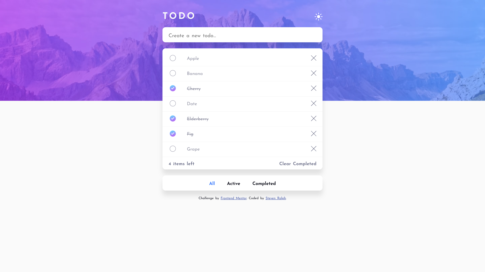
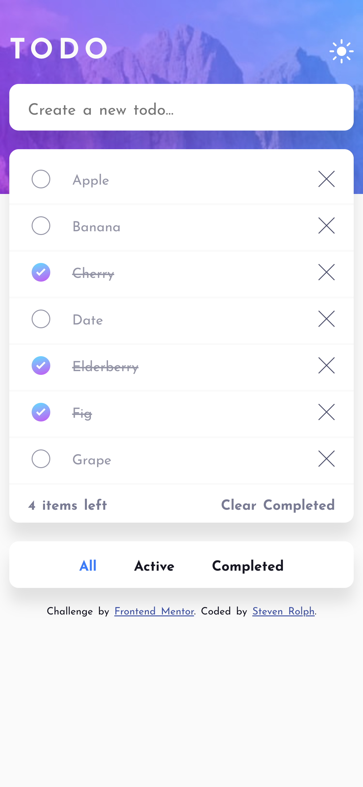

# Frontend Mentor - Todo app solution

This is a solution to the [Todo app challenge on Frontend Mentor](https://www.frontendmentor.io/challenges/todo-app-Su1_KokOW). Frontend Mentor challenges help you improve your coding skills by building realistic projects.

## Table of contents

- [Overview](#overview)
  - [The challenge](#the-challenge)
  - [Screenshot](#screenshot)
  - [Links](#links)
- [My process](#my-process)
  - [Built with](#built-with)
  - [Notes](#notes)
  - [What I learned](#what-i-learned)
- [Author](#author)
- [Acknowledgments](#acknowledgments)

**Note: Delete this note and update the table of contents based on what sections you keep.**

## Overview

### The challenge

Users should be able to:

- View the optimal layout for the app depending on their device's screen size ✅
- See hover states for all interactive elements on the page ✅
- Add new todos to the list ✅
- Mark todos as complete ✅
- Delete todos from the list ✅
- Filter by all/active/complete todos ✅
- Clear all completed todos ✅
- Toggle light and dark mode ❌
- **Bonus**: Drag and drop to reorder items on the list ❌

### Screenshot

### Links

- Solution URL: [Add solution URL here](https://your-solution-url.com)
- Live Site URL: [https://valleyman89.github.io/FrontEndMentor-Solution---to-do-app-](hthttps://valleyman89.github.io/FrontEndMentor-Solution---to-do-app-)

## My process

### Built with

- CSS custom properties
- Flexbox
- CSS Grid
- Mobile-first workflow
- [React](https://reactjs.org/) - JS library
- [react-gh-pages](https://github.com/gitname/react-gh-pages) - for deployment onGitHub Pages

### Notes

- This originally was completed with prop-drilling but thanks to @andrewg010 (see [#Acknowledgments](acknowlodgements)), it was converted to use context
- I was not able to implement the light/dark theme toggle - I think I'd need to utilise npm packages to complete this.
- Likewise for the drag-and-drop feature.

### Useful resources

- [Using localStorage with React Hooks - LogRocket](https://blog.logrocket.com/using-localstorage-react-hooks/) - Ibadehin Mojeed's thorough explanation how to utilise localStorage with React Hooks was extremely helpful - along with their `useLocalStorage` custom hook which was used in this project.

## Author

- GitHub - [@valleyman89](https://github.com/valleyman89)
- Frontend Mentor - [@valleyman89](https://www.frontendmentor.io/profile/valleyman89)
- Twitter - [@steven_rolph](https://www.twitter.com/steven_rolph)

## Acknowledgments

- [https://github.com/andrewg010](https://github.com/andrewg010) - andrewg010 for the code and explanation of context within react - see the context branch of the repo.
